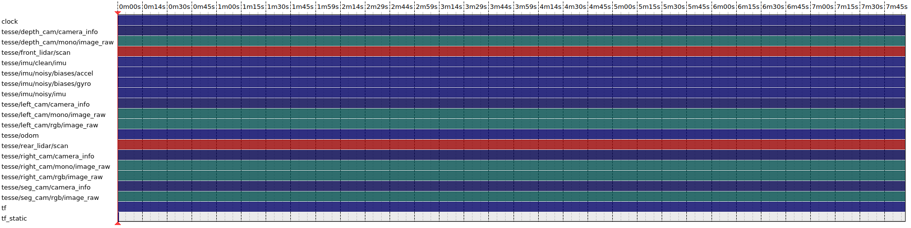

## Hydra

<div align="center">
    
</div>

This repository contains code to incrementally build 3D Scene Graphs in real-time and is based on the papers:
  - ["Hydra: A Real-time Spatial Perception System for 3D Scene Graph Construction and Optimization"](http://www.roboticsproceedings.org/rss18/p050.pdf)
  - ["Foundations of Spatial Perception for Robotics: Hierarchical Representations and Real-time Systems"](https://journals.sagepub.com/doi/10.1177/02783649241229725)


## Installation and Running

### General Requirements

Hydra has been tested on Ubuntu 20.04 and ROS Noetic.

Then, make sure you have some general requirements:
```
sudo apt install python3-rosdep python3-catkin-tools python3-vcstool
```

Finally, if you haven't set up rosdep yet:
```
sudo rosdep init
rosdep update
```

### Building Hydra

To get started:

```
mkdir -p hydra_ws/src
cd hydra_ws
catkin init
catkin config -DCMAKE_BUILD_TYPE=Release
cd src
git clone git@github.com:ArghyaChatterjee/Hydra.git hydra
vcs import . < hydra/install/hydra.rosinstall
rosdep install --from-paths . --ignore-src -r -y
cd ..
catkin build
```

> **Note**<br>
> Depending on the amount of RAM available on your machine and whether or not you are compiling Kimera-VIO as well, you may run out of memory when compiling with `catkin build` directly (which will result in a `GCC killed` error). If this occurs, you can either specify fewer threads for catkin via `catkin build -j NUM_THREADS` or compile certain larger packages directly first by building them specifically.

### Quickstart

#### Downloads
Download a single scene (the office scene without humans is recommended, and can be found [here](https://drive.google.com/uc?id=1CA_1Awu-bewJKpDrILzWok_H_6cOkGDb). The file is around ~16.8 GBs.

<div align="center">
    
</div>

Here are the topics from rosbag:
```
$ rosbag info uHumans2_office_s1_00h.bag 
path:         uHumans2_office_s1_00h.bag
version:      2.0
duration:     8:26s (506s)
start:        Dec 31 1969 18:00:11.40 (11.40)
end:          Dec 31 1969 18:08:37.55 (517.55)
size:         15.7 GB
messages:     742621
compression:  bz2 [33230/33230 chunks; 38.68%]
uncompressed: 40.4 GB @ 81.8 MB/s
compressed:   15.6 GB @ 31.6 MB/s (38.68%)
types:        geometry_msgs/Vector3Stamped [7b324c7325e683bf02a9b14b01090ec7]
              nav_msgs/Odometry            [cd5e73d190d741a2f92e81eda573aca7]
              rosgraph_msgs/Clock          [a9c97c1d230cfc112e270351a944ee47]
              sensor_msgs/CameraInfo       [c9a58c1b0b154e0e6da7578cb991d214]
              sensor_msgs/Image            [060021388200f6f0f447d0fcd9c64743]
              sensor_msgs/Imu              [6a62c6daae103f4ff57a132d6f95cec2]
              sensor_msgs/LaserScan        [90c7ef2dc6895d81024acba2ac42f369]
              tf2_msgs/TFMessage           [94810edda583a504dfda3829e70d7eec]
topics:       /clock                             10151 msgs    : rosgraph_msgs/Clock         
              /tesse/depth_cam/camera_info        8307 msgs    : sensor_msgs/CameraInfo      
              /tesse/depth_cam/mono/image_raw     8307 msgs    : sensor_msgs/Image           
              /tesse/front_lidar/scan            16962 msgs    : sensor_msgs/LaserScan       
              /tesse/imu/clean/imu              101213 msgs    : sensor_msgs/Imu             
              /tesse/imu/noisy/biases/accel     101150 msgs    : geometry_msgs/Vector3Stamped
              /tesse/imu/noisy/biases/gyro      101150 msgs    : geometry_msgs/Vector3Stamped
              /tesse/imu/noisy/imu              101212 msgs    : sensor_msgs/Imu             
              /tesse/left_cam/camera_info         8307 msgs    : sensor_msgs/CameraInfo      
              /tesse/left_cam/mono/image_raw      8307 msgs    : sensor_msgs/Image           
              /tesse/left_cam/rgb/image_raw       8307 msgs    : sensor_msgs/Image           
              /tesse/odom                       101213 msgs    : nav_msgs/Odometry           
              /tesse/rear_lidar/scan             16962 msgs    : sensor_msgs/LaserScan       
              /tesse/right_cam/camera_info        8307 msgs    : sensor_msgs/CameraInfo      
              /tesse/right_cam/mono/image_raw     8307 msgs    : sensor_msgs/Image           
              /tesse/right_cam/rgb/image_raw      8307 msgs    : sensor_msgs/Image           
              /tesse/seg_cam/camera_info          8307 msgs    : sensor_msgs/CameraInfo      
              /tesse/seg_cam/rgb/image_raw        8307 msgs    : sensor_msgs/Image           
              /tf                               109537 msgs    : tf2_msgs/TFMessage          
              /tf_static                             1 msg     : tf2_msgs/TFMessage

```

#### Launch Hydra
Start Hydra in a terminal:
```
source /opt/ros/noetic/setup.bash
source devel/setup.bash
roslaunch hydra_ros uhumans2.launch
```

Start the rosbag in a separate terminal:
```
source /opt/ros/noetic/setup.bash
source devel/setup.bash
rosbag play ~/uHumans2_office_s1_00h.bag --clock
```
Topics to subscribe from rosbag:
```
/clock [rosgraph_msgs/Clock]
/tesse/depth_cam/mono/image_raw [sensor_msgs/Image]
/tesse/left_cam/rgb/image_raw [sensor_msgs/Image]
/tesse/seg_cam/rgb/image_raw [sensor_msgs/Image]
/tf [tf2_msgs/TFMessage]
/tf_static [tf2_msgs/TFMessage]
```
Topics Publishing rate from rosbag:
```
/tf_static                      : Once
/tf                             : 228 Hz
/clock                          : 21 Hz
/tesse/depth_cam/mono/image_raw : 17 Hz
/tesse/left_cam/rgb/image_raw   : 17 Hz
/tesse/seg_cam/rgb/image_raw    : 17 Hz
```
Echo Topics:
```
$rostopic echo /tf
transforms: 
  - 
    header: 
      seq: 0
      stamp: 
        secs: 432
        nsecs: 154899999
      frame_id: "world"
    child_frame_id: "base_link_gt"
    transform: 
      translation: 
        x: 19.73053
        y: 25.51378
        z: 2.497293
      rotation: 
        x: 0.008492810313284773
        y: 0.006425529979661489
        z: 0.7974413381818911
        w: 0.6033024920354114
```
Echo /tf_static topic:
```
arghya@arghya-Pulse-GL66-12UEK:~$ rostopic echo /tf_static
transforms: 
  - 
    header: 
      seq: 0
      stamp: 
        secs: 0
        nsecs:         0
      frame_id: "base_link_gt"
    child_frame_id: "right_cam"
    transform: 
      translation: 
        x: 0.0
        y: -0.05
        z: 0.0
      rotation: 
        x: 0.5
        y: -0.5
        z: 0.5
        w: -0.5
---
transforms: 
  - 
    header: 
      seq: 0
      stamp: 
        secs: 0
        nsecs:         0
      frame_id: "base_link_gt"
    child_frame_id: "left_cam"
    transform: 
      translation: 
        x: 0.0
        y: 0.05
        z: 0.0
      rotation: 
        x: 0.5
        y: -0.5
        z: 0.5
        w: -0.5
---
transforms: 
  - 
    header: 
      seq: 0
      stamp: 
        secs: 0
        nsecs:         0
      frame_id: "base_link_gt"
    child_frame_id: "left_cam"
    transform: 
      translation: 
        x: 0.0
        y: 0.05
        z: 0.0
      rotation: 
        x: 0.5
        y: -0.5
        z: 0.5
        w: -0.5
---
transforms: 
  - 
    header: 
      seq: 0
      stamp: 
        secs: 0
        nsecs:         0
      frame_id: "base_link_gt"
    child_frame_id: "left_cam"
    transform: 
      translation: 
        x: 0.0
        y: 0.05
        z: 0.0
      rotation: 
        x: 0.5
        y: -0.5
        z: 0.5
        w: -0.5
---
transforms: 
  - 
    header: 
      seq: 0
      stamp: 
        secs: 0
        nsecs:         0
      frame_id: "base_link_gt"
    child_frame_id: "rear_lidar"
    transform: 
      translation: 
        x: -0.17
        y: -0.017
        z: 0.0
      rotation: 
        x: 0.0
        y: 0.0
        z: 0.0
        w: 1.0
---
transforms: 
  - 
    header: 
      seq: 0
      stamp: 
        secs: 0
        nsecs:         0
      frame_id: "map"
    child_frame_id: "world"
    transform: 
      translation: 
        x: 0.0
        y: 0.0
        z: 0.0
      rotation: 
        x: 0.0
        y: 0.0
        z: 0.0
        w: 1.0
---
transforms: 
  - 
    header: 
      seq: 0
      stamp: 
        secs: 0
        nsecs:         0
      frame_id: "base_link_gt"
    child_frame_id: "front_lidar"
    transform: 
      translation: 
        x: 0.17
        y: -0.017
        z: 0.0
      rotation: 
        x: 0.0
        y: 0.0
        z: 0.0
        w: 1.0
---
```
#### Output List
Here is the output topic list:
```
/clock
/hydra_dsg_visualizer/config/dynamic_layer/2/parameter_descriptions
/hydra_dsg_visualizer/config/dynamic_layer/2/parameter_updates
/hydra_dsg_visualizer/config/layer2/parameter_descriptions
/hydra_dsg_visualizer/config/layer2/parameter_updates
/hydra_dsg_visualizer/config/layer20/parameter_descriptions
/hydra_dsg_visualizer/config/layer20/parameter_updates
/hydra_dsg_visualizer/config/layer3/parameter_descriptions
/hydra_dsg_visualizer/config/layer3/parameter_updates
/hydra_dsg_visualizer/config/layer4/parameter_descriptions
/hydra_dsg_visualizer/config/layer4/parameter_updates
/hydra_dsg_visualizer/config/layer5/parameter_descriptions
/hydra_dsg_visualizer/config/layer5/parameter_updates
/hydra_dsg_visualizer/config/parameter_descriptions
/hydra_dsg_visualizer/config/parameter_updates
/hydra_dsg_visualizer/dsg_markers
/hydra_dsg_visualizer/dsg_mesh
/hydra_dsg_visualizer/dynamic_layers_viz
/hydra_dsg_visualizer/gt_regions
/hydra_ros_node/backend/deformation_graph_mesh_mesh
/hydra_ros_node/backend/deformation_graph_pose_mesh
/hydra_ros_node/backend/dsg
/hydra_ros_node/backend/pose_graph
/hydra_ros_node/frontend/dsg
/hydra_ros_node/frontend/full_mesh_update
/hydra_ros_node/frontend/mesh_graph_incremental
/hydra_ros_node/gvd/occupancy
/hydra_ros_node/objects/active_vertices
/hydra_ros_node/objects/object_vertices_semantic_label_10
/hydra_ros_node/objects/object_vertices_semantic_label_12
/hydra_ros_node/objects/object_vertices_semantic_label_13
/hydra_ros_node/objects/object_vertices_semantic_label_18
/hydra_ros_node/objects/object_vertices_semantic_label_5
/hydra_ros_node/objects/object_vertices_semantic_label_7
/hydra_ros_node/places/esdf_viz
/hydra_ros_node/places/freespace_graph_viz
/hydra_ros_node/places/freespace_viz
/hydra_ros_node/places/graph_visualizer/parameter_descriptions
/hydra_ros_node/places/graph_visualizer/parameter_updates
/hydra_ros_node/places/graph_viz
/hydra_ros_node/places/gvd_cluster_viz
/hydra_ros_node/places/gvd_graph_viz
/hydra_ros_node/places/gvd_visualizer/parameter_descriptions
/hydra_ros_node/places/gvd_visualizer/parameter_updates
/hydra_ros_node/places/gvd_viz
/hydra_ros_node/places/surface_viz
/hydra_ros_node/places/visualizer_colormap/parameter_descriptions
/hydra_ros_node/places/visualizer_colormap/parameter_updates
/hydra_ros_node/places/voxel_block_viz
/hydra_ros_node/reconstruction/tsdf_viz
/hydra_ros_node/reconstruction/tsdf_weight_viz
/hydra_ros_node/tsdf/occupancy
/incremental_dsg_builder_node/pgmo/deformation_graph_mesh_mesh
/incremental_dsg_builder_node/pgmo/deformation_graph_mesh_mesh_array
/incremental_dsg_builder_node/pgmo/deformation_graph_pose_mesh
/incremental_dsg_builder_node/pgmo/deformation_graph_pose_mesh_array
/tesse/depth_cam/camera_info
/tesse/depth_cam/mono/image_raw
/tesse/front_lidar/scan
/tesse/imu/clean/imu
/tesse/imu/noisy/biases/accel
/tesse/imu/noisy/biases/gyro
/tesse/imu/noisy/imu
/tesse/left_cam/camera_info
/tesse/left_cam/mono/image_raw
/tesse/left_cam/rgb/image_raw
/tesse/odom
/tesse/rear_lidar/scan
/tesse/right_cam/camera_info
/tesse/right_cam/mono/image_raw
/tesse/right_cam/rgb/image_raw
/tesse/seg_cam/camera_info
/tesse/seg_cam/rgb/image_raw
/tf
/tf_static
```

Here is the output nodes:
```
/bag_static_tf_0
/bag_static_tf_1
/bag_static_tf_2
/bag_static_tf_3
/bag_static_tf_4
/bag_static_tf_5
/fake_world_tf
/hydra_dsg_visualizer
/hydra_ros_node
/play_1732218976941353811
/rosout
/rqt_gui_cpp_node_23218
/rqt_gui_cpp_node_24120
/rqt_gui_py_node_23218
/rqt_gui_py_node_24120
/rviz
```
### Running Hydra

See [here](https://github.com/MIT-SPARK/Hydra-ROS/blob/main/doc/quickstart.md) for detailed instructions discussing how to run Hydra using ROS.
These also detail how to use Hydra with [Kimera-VIO](https://github.com/MIT-SPARK/Kimera-VIO.git), including how to build Kimera-VIO alongside Hydra.

### Hydra Python Bindings

See [here](python/README.md) for information

### Hydra Evaluation

See [here](eval/README.md) for information

### Using a Semantic Segmentation Network

> **Note**<br>
> This package is not public (yet)

Add `semantic_recolor` to your workspace via:

```
roscd && cd ../src
vcs import . < hydra/install/semantic_overlay.rosinstall
```

Then, follow the instructions to install cuda and other dependencies for the `semantic_recolor` package (which can be found [here](https://github.mit.edu/SPARK/semantic_recolor_nodelet#semantic-recolor-utilities)).

Finally, build your workspace:

```
catkin build
```
